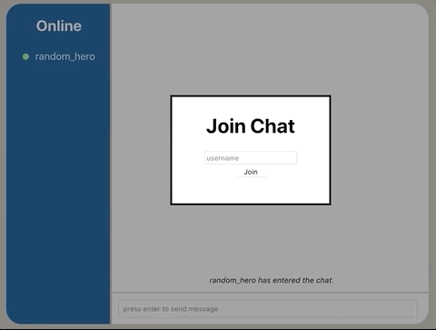

## Chat




A simple chat application using Flask, SocketIO, and React.js.

### Setup

Make sure you have Python3 and pip.

First install dependencies.

```
cd server
pip install -r requirements.txt
```

### Start server

Open a new tab in project and run the following commands.

```
cd client
yarn start-server
```

### Start client

Open another new tab and run these commands.

```
cd client
yarn start
```
